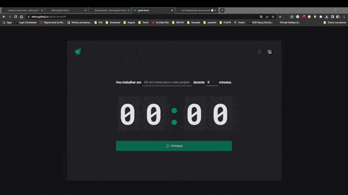

# Ignite Timer
Projeto desenvolvido durante aula do curso, utilzando conceitos mais importantes do react. Como contextApi, reducers, routers e outros.



## Funcionalidades:
  * Criar Temporizador
  * Histórico de Temporizador
  * Iniciar Temporizador
  * Interromper Temporizador

  ## Iniciar Projeto
  ```
  npm i
  ```
   ```
  npm run dev
  ```
  
   ## Link Page
  <https://dehrs.github.io/ignite-timer/>
